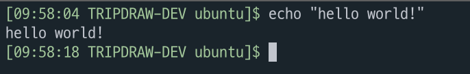

서버 설정을 하다보면 쉘만 보고 프로덕션 서버인지, 개발 서버인지 구분하기 어려울 때가 있습니다.  
서버별로 쉘 프롬프트를 설정하면 이 불편함을 해결 할 수 있습니다.  

### 계정 별 터미널 설정

PS1은 리눅스 기반 운영 체제에서 사용자의 쉘 프롬프트를 설정하기 위해 사용되는 환경 변수입니다.  
해당 환경 변수를 변경하면 사용자명, 시간 정보 등 필요한 정보를 원하는 대로 설정할 수 있습니다.  
~/.bashrc 파일에 PS1에 대한 값을 설정한다면 동일한 계정으로 재접속하여도 설정을 유지할 수 있습니다.  

### 이스케이프 문자

이스케이프 문자를 사용하여 쉘 프롬프트에 서버에 대한 정보를 추가할 수 있습니다.  

| 이스케이프 문자 | 설명 |
| --- | --- |
| \u | 사용자 이름 |
| \h | 호스트 이름 |
| \w | 현재 작업 디렉토리 (전체 경로) |
| \W | 현재 작업 디렉토리 (디렉토리 이름) |
| \d | 현재 날짜 (YYYY-MM-DD) |
| \t | 현재 시간 (HH:MM:SS) |
| \n | 줄 바꿈 문자 |
| \$ | 일반 사용자 $ root의 경우 # |

### 색상 설정

`\e[` - 색상 변경을 시작하고 싶을 때 사용합니다.  
`색상코드m` - 색상을 선택합니다.  
`\e[0m` - 색상 변경을 종료하고 싶을 때 사용합니다.

```bash
빨간색 hello world → "\e[31mhello world!\e[0m"
```

echo -e 옵션을 사용하여 색상이 정상적으로 적용되었는지 확인할 수 있습니다.  

```bash
echo -e "\e[31mhello world! \e[0m"
```

### 색상표

| 색상 | 글자색 | 배경색 |
| --- | --- | --- |
| Black | 30 | 40 |
| Red | 31 | 41 |
| Green | 32 | 42 |
| Yellow | 33 | 43 |
| Blue | 34 | 44 |
| Purple | 35 | 45 |
| Cyan | 36 | 46 |
| White | 37 | 47 |

### ~/.bashrc 파일에 적용

`sudo vim ~/.bashrc` 을 입력하여 설정 파일을 연 후에 적용하고 싶은 문자를 PS1 환경변수에 할당하고 저장합니다.  

```bash title="~/.bashrc"
PS1="\e[32m[\t TRIPDRAW-DEV \u]\$ \e[0m"
```

적용은 source 명령어를 이용하면 됩니다.  

```bash
source ~/.bashrc
```



### 참고 자료

[Linux Hint](https://linuxhint.com/bash-ps1-customization/)
