안녕하세요! 트립드로우 팀의 수달입니다.  
이 글을 통해 안드로이드에서 ViewModel에 대한 테스트를 작성하는 방법에 대해 설명드려고 합니다. 단위 테스트가 무엇인지 이해하고, 적용해본 경험이 있는 사람을 대상으로 설명드리겠습니다.  
이 글을 읽고 ViewModel 테스트와 친해지길 바라겠습니다! 화이팅!

# Android ViewModel Test

일반적인 ViewModel은 사전 준비 없이 테스트하게 된다면 테스트에 실패합니다. 여기에는 크게 두가지 경우가 있습니다. ViewModel의 LiveData value 변경에 대한 테스트, Coroutine과 같은 비동기 작업에 대한 테스트입니다. 두 경우에 대한 실패 원인은 같습니다. 이는 테스트가 MainThread에서 작동하지 않는다는 것입니다.

## 테스트는 WorkerThread에서 작동한다.

테스트는 MainThread에서 수행하지 않고, WorkerThread에서 작동합니다. 이것이 왜 LiveData value 변경 테스트와 Coroitine 테스트의 실패의 원인이 될까요?  
우선, 테스트가 WorkerThread에서 작동한다는 것을 확인해보고, 이것이 왜 테스트 실패의 원인이 되는지 알아보겠습니다. 아래의 코드를 보면 테스트가 "Test worker" 스레드에서 동작하는 것을 확인할 수 있습니다.  
<br>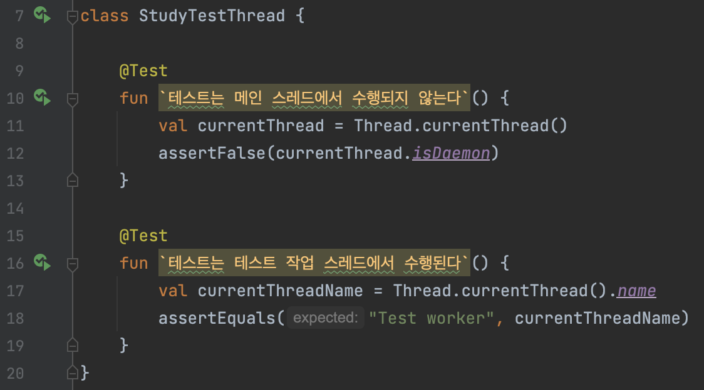<br>

# LiveData Test

아래의 `ViewModel`코드를 보면 \_products라는 LivaData value에 변경이 발생하고 있습니다.  
<br>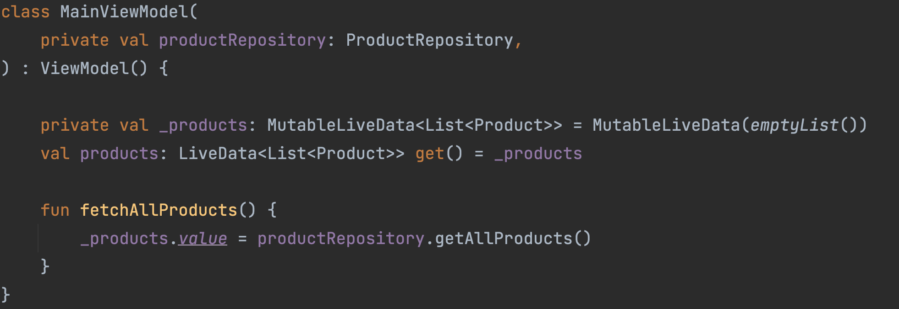<br>  
아래의 `ViewModelTest` 코드를 보면 products라는 LivaData value에 변경이 발생하고 있는지 확인하고 있습니다.  
<br>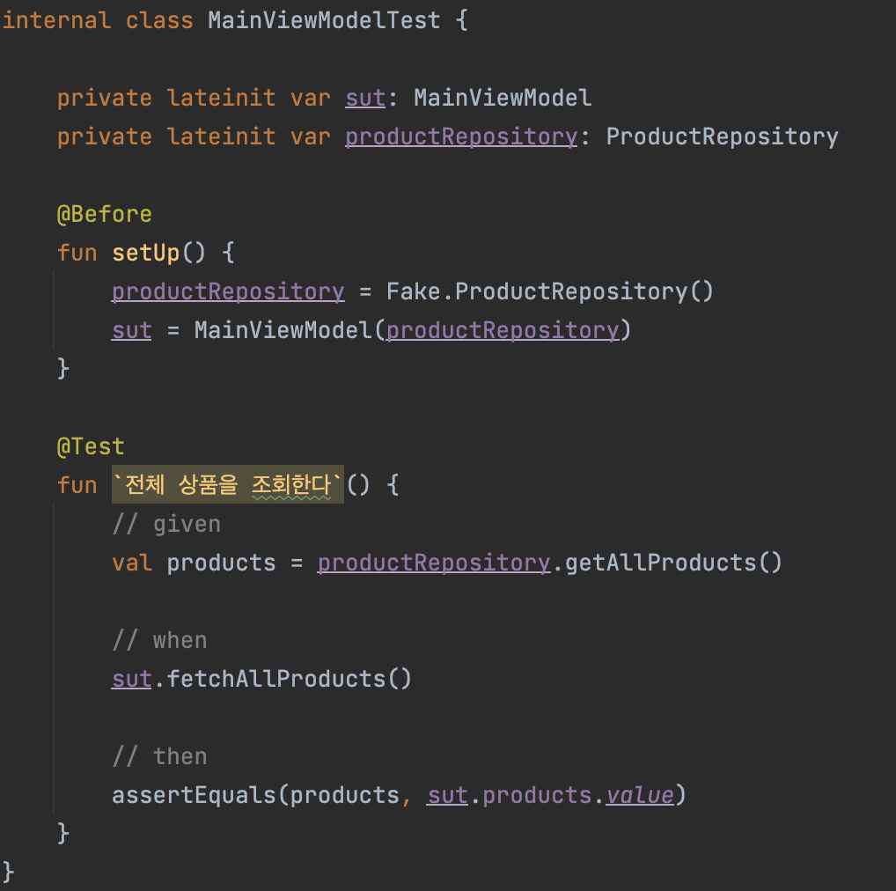<br>  
이렇게 테스트하면 LiveData의 value를 변경하는 코드에서 오류가 발생합니다.  
<br>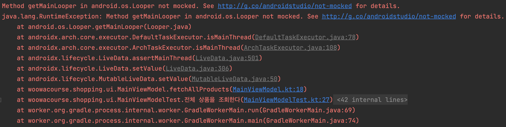<br>

## LiveData의 setValue() / postValue()는 MainThread에서 작동한다

```kotlin
@MainThread
protected void setValue(T value) {
    assertMainThread("setValue");
    mVersion++;
    mData = value;
    dispatchingValue(null);
}

protected void postValue(T value) {
    boolean postTask;
    synchronized (mDataLock) {
        postTask = mPendingData == NOT_SET;
        mPendingData = value;
    }
    if (!postTask) {
        return;
    }
    ArchTaskExecutor.getInstance().postToMainThread(mPostValueRunnable);
}
```

앞서 설명드렸듯이 테스트는 `Tast worker` 스레드에서 동작하지만, 테스트에서 확인하고자하는 LiveData의 값 변경은 `Main` 스레드에서 작업이 일어나야합니다. 이 과정에서 오류가 발생합니다.

## InstantTaskExecutorRule()

스레드가 달라서 발생하는 문제를 해결하기 위해 InstantTaskExecutorRule을 설정해주어야 합니다.  
<br>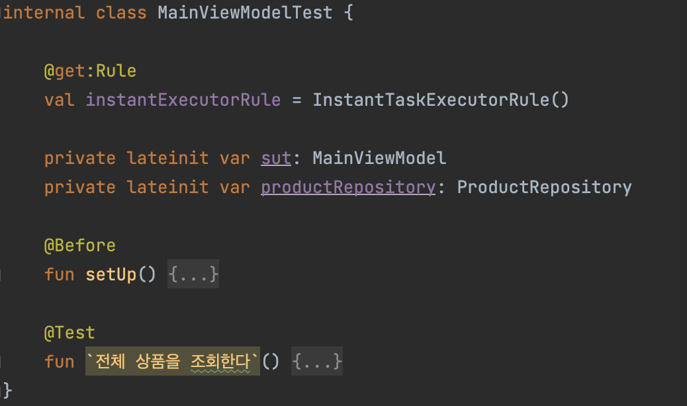<br>

InstantTaskExecutorRule은 ArchTaskExecutor가 새로운 TaskExecutor를 생성하면서 isMainThread 메소드를 강제로 true로 리턴하도록 합니다.  
<br>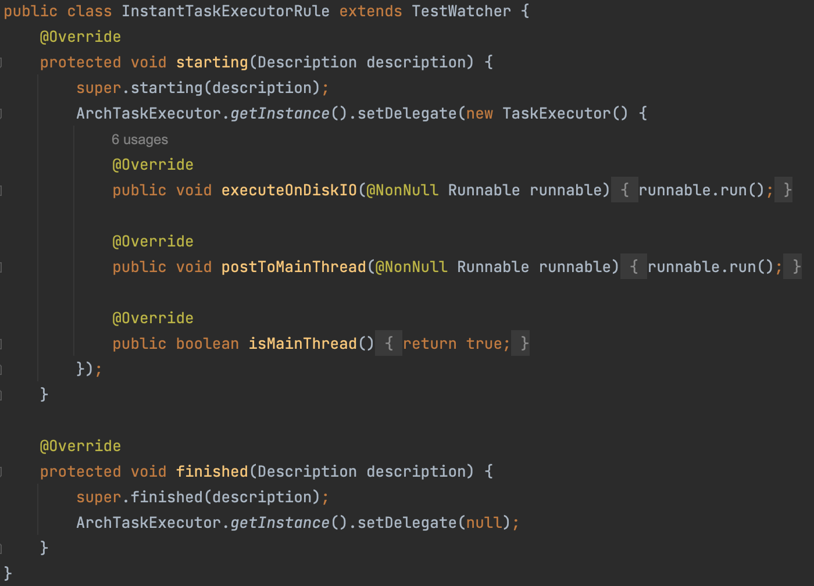<br>

# Coroutine Test

`viewModelscope.launch`를 사용하는 코드에 대한 테스트를 기준으로 설명드리겠습니다.  
<br>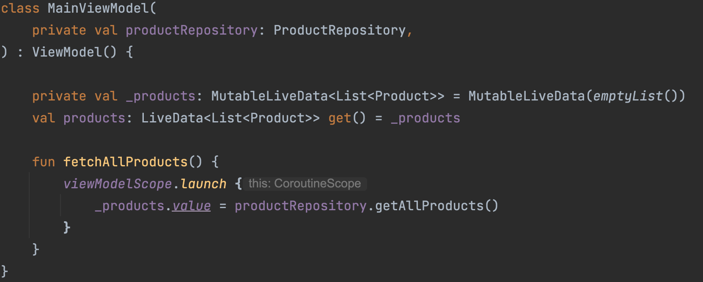
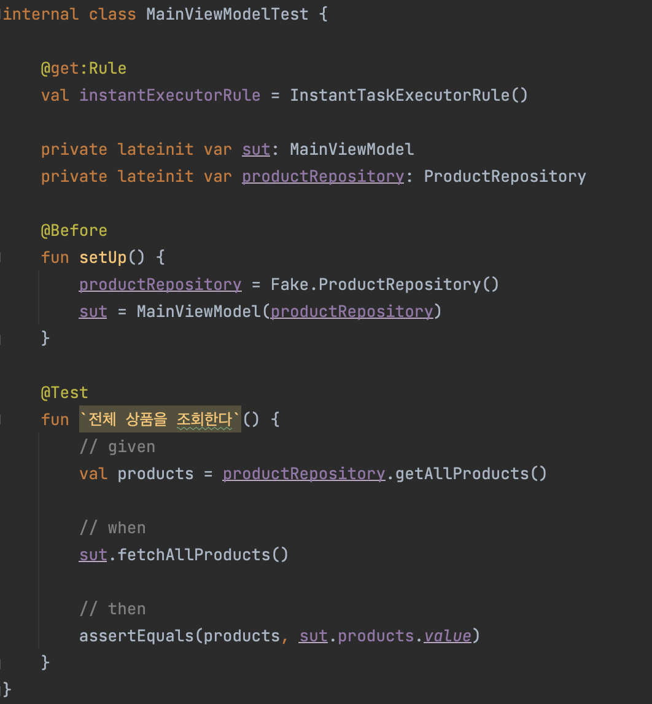<br>  
이 또한 LiveData와 같은 이유로 테스트에 실패합니다.

## viewModelScope.launch는 Dispatcher가 적용되지 않으면 MainThread에서 작동한다.

```kotlin
public fun CoroutineScope.launch(
    context: CoroutineContext = EmptyCoroutineContext,
    start: CoroutineStart = CoroutineStart.DEFAULT,
    block: suspend CoroutineScope.() -> Unit
): Job {
    val newContext = newCoroutineContext(context)
    val coroutine = if (start.isLazy)
        LazyStandaloneCoroutine(newContext, block) else
        StandaloneCoroutine(newContext, active = true)
    coroutine.start(start, coroutine, block)
    return coroutine
}
```

테스트는 `Tast worker` 스레드에서 동작하고, 코루틴은 `Main` 스레드에서 작업이 일어나야합니다. 이 과정에서 오류가 발생합니다.

## Dispatchers.setMain / Dispatchers.resetMain

스레드가 달라서 발생하는 문제를 해결하기 위해 `TestDispatcher.Main`으로 설정해주어야 합니다. 즉, 테스트가 Main Thread에서 일어나도록 합니다.  
테스트가 종료된 후에는 테스트가 메인 스레드에 영향을 주지 않도록 `Tast worker` 스레드에서 동작하도록 재설정합니다.  
<br>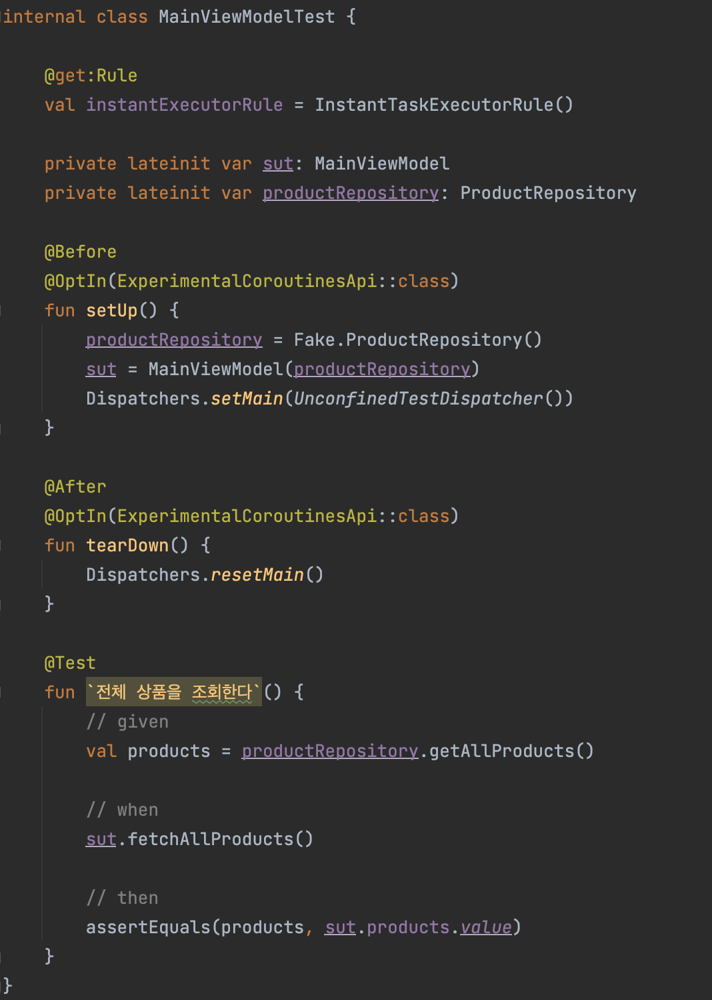<br>

## Coroutine Rule

앞서 설명드린대로 테스트가 시작할 때 스레드를 설정하고, 테스트가 끝날 때 스레드를 다시 설정하는 코드가 있으면 테스트가 조금 더 귀찮아질겁니다. 그러니 룰을 생성해 이 문제를 해결하도록 하겠습니다.  
아래의 코드처럼 룰을 작성해줍니다.  
<br>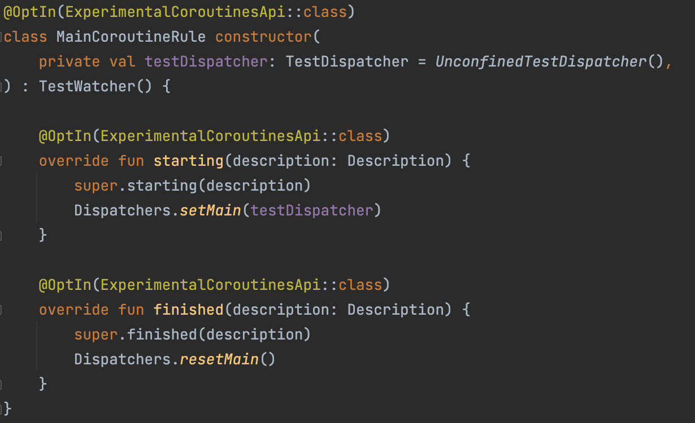<br>  
만들어둔 룰을 테스트 룰에 적용시켜준다면 테스트 시작과 종료 시점에 스레드를 설정하는 코드를 추가로 작성하지 않아도 됩니다.  
<br>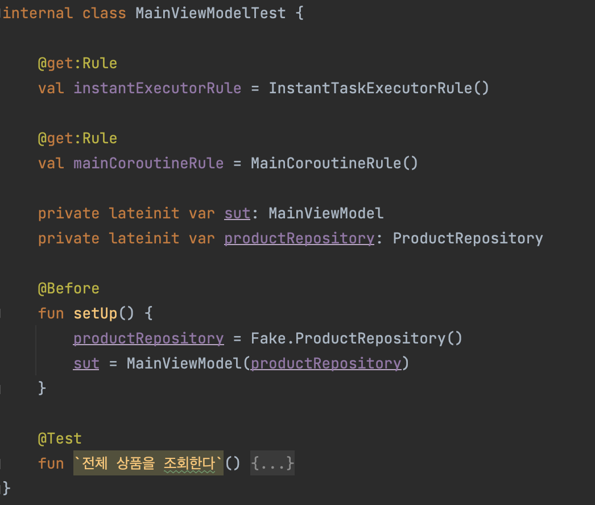<br>

---

이해가 잘 되셨기를 바랍니다... 총총...
