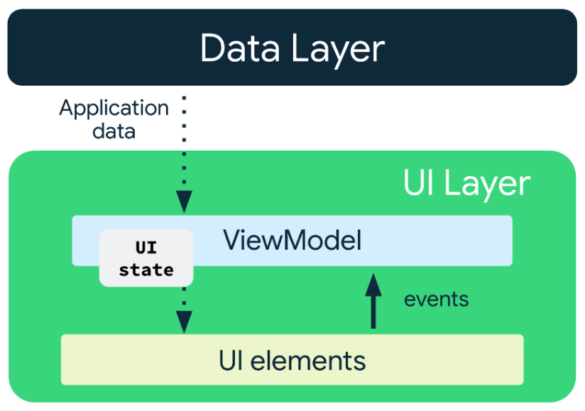
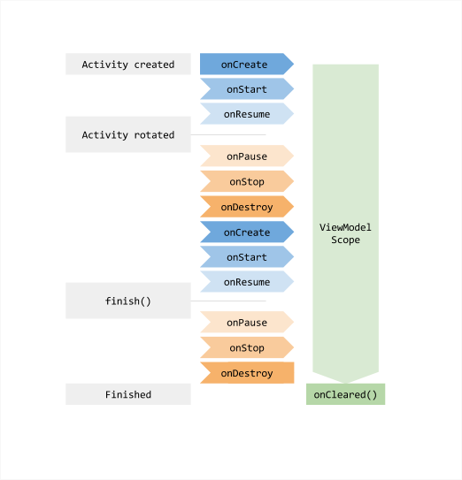
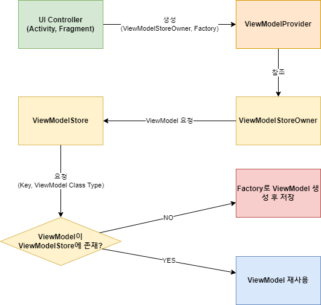
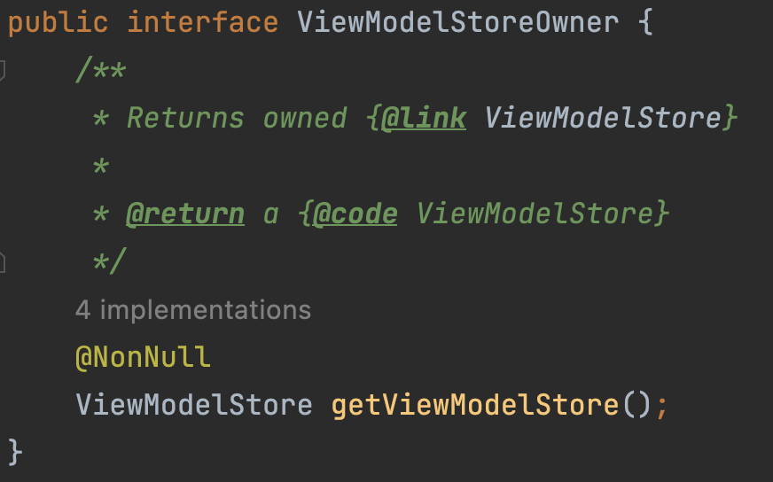
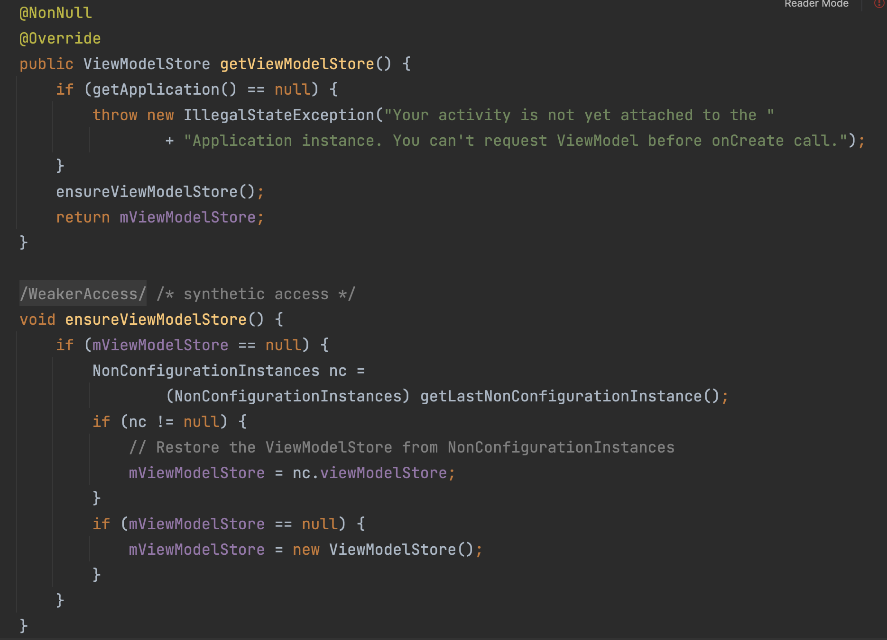
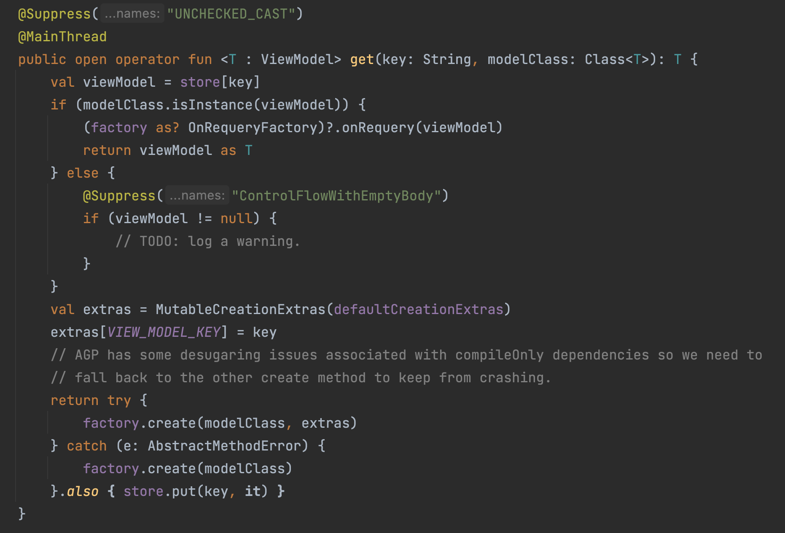

안녕하세요. 트립드로우의 핑구입니다.  
저는 이번 프로젝트를 하면서 처음으로 MVVM을 접하게 되었는데요, 이번 글에서는 ViewModel의 생성 과정에 대해 말씀드리려고 합니다.  
도대체 얘는 뭐하는 아이이고 어떻게 만들어지는 걸까요?


## ViewModel이란?

ViewModel은 무엇일까요? 공식 문서에는 이렇게 나와있습니다. 
> ViewModel 클래스는 비즈니스 로직 또는 화면 수준 상태 홀더입니다. UI에 상태를 노출하고 관련 비즈니스 로직을 캡슐화합니다.

사용자 이벤트를 처리하여 데이터, 도메인 측에서 화면 UI로 데이터를 변환해주는 역할 또는 화면에 표시해야하는 항목을 들고 있어주는 (holder) 역할입니다.



공식문서에서는 위와 같은 단방향 데이터 흐름(UDF)를 권장합니다.  
보이는 것과 같이 UI 요소에서 이벤트를 ViewModel로 보내면 ViewModel 측에서 이를 처리하며 데이터와 도메인 계층에서 데이터를 받고 이를 다시 화면에 띄워주게 됩니다.  
또한 ViewModel은 UI 상태(UI State)에 대한 정보도 들고 있습니다.

이렇게 ViewModel은 **UI 관련 데이터를 저장하고 관리해주는 역할**을 합니다.


## ViewModel의 이점

ViewModel의 가장 큰 장점은 구성 변경에도 UI 상태를 유지한다는 것입니다.

글꼴 크기, 언어, 테마 변경, 화면 방향 등 기기 설정을 변경하는 것을 구성 변경이라고 합니다.  
이렇게 구성 변경이 발생하게 되면 Activity는 없어졌다가 다시 만들어지게 됩니다.
그렇게 된다면 화면에 있던 값이 다 날라가게 되겠죠? 

예를 들어 버튼을 누르면 숫자가 올라가는 Activity가 있다고 했을 때,  
버튼을 10번 눌러 화면의 숫자를 10으로 만들고 화면 회전을 한다면 화면의 숫자는 다시 0이 되어 있을 것 입니다.

이러한 문제점은 ViewModel을 사용하게 되면 해결할 수 있습니다!



위의 그림은 ViewModel의 생명주기를 잘 보여줍니다.  
Activity가 최초로 생성될 때 ViewModel이 생성되게 되고 구성변경으로 인해 Activity가 다시 시작하더라도 ViewModel은 계속 메모리에 남아있습니다.


# ViewModel 생성 과정

그렇다면 이런 ViewModel은 어떤 순서로 만들어지는 걸까요?



ViewModel은 위와 같은 과정을 거쳐 만들어집니다. 코드를 뜯어 보며 이해해봅시다.

먼저 Activity에서 ViewModel을 요청하며 ViewModelProvider를 생성합니다.

```kotlin
private val viewModel: MainViewModel by lazy {
	ViewModelProvider(this)[MainViewModel::class.java]
}
```

여기서 ViewModelProvider는 생성되면서 `ViewModelStoreOwner`와 `Factory`(optional)을 요구합니다. Factory를 주지않으면 DefaultFactory를 사용합니다.

잠깐! 여기서 왜 ViewModelStoreOwner자리에 `this`(여기서는 Activity)를 넘기게 되는걸까요? ViewModelStoreOwner 는 말그대로 ViewModelStore를 가지고 있는 애들을 가리키는 인터페이스입니다.



[ComponentActivity](https://developer.android.com/reference/androidx/activity/ComponentActivity), [Fragment](https://developer.android.com/reference/androidx/fragment/app/Fragment), [NavBackStackEntry](https://developer.android.com/reference/androidx/navigation/NavBackStackEntry) 이 이를 구현하고 있어요. 그리고 이 `ViewModelStoreOwner`는 `ViewModelStore`를 주는 `getViewModelStore()`를 가지고 있습니다.




ComponentActivity에서의 getviewModelStroe()입니다.
NonConfigurationInstances 는 구성변경 시에도 화면의 이전 상태를 유지하고 데이터를 보존하는 데 사용되는 클래스 입니다.
지난번에 저장해놓았던 것들을 꺼내오거나 아니면 새로 만들어 반환하게 됩니다.


다시 돌아와서, ViewModelProvider에서 get()을 호출하여 ViewModel을 생성하게 됩니다.




바로 이 함수입니다.

get으로 ViewModel을 요청했을 때 ViewModelStore에 있으면 꺼내오고 없다면 factory로 새로 만들어주게 됩니다. 

그렇다면 ViewModelStore는 무엇일까요?


이름처럼 ViewModel들을 저장하는 클래스입니다. 

key 값에 패키지 이름과 클래스 이름이 합쳐진 형태(canonicalName)가 들어가고 value 값에는 viewModel이 들어가있습니다.

구성변경으로 ViewModelStore의 Owner가 destroy되었다가 다시 생성되어도 Owner는 이전의 ViewModelStore를 가지고 있습니다. destroy되었다가 다시 생성되지 않는다면 clear()를 호출해 줍니다.

### 정리를 해봅시다

1. ViewModelProvider를 생성한다.
2. ViewModelProvider은 ViewModelStoreOwner를 참조하고 여기서 ViewModelStore를 요청한다.
    - ViewModelStore가 있다면 주고 없다면 만들어낸다.
3. ViewModelStore가 요청하는 ViewModel을 가져온다.
    - 없으면 Factory로 새로 만들어내며 ViewModelStore에 저장한다.


하나하나 코드로 보니 복잡해 보일 수도 있지만 요약하자면 위와 같이 간단합니다.

궁금하다면 직접 코드로 확인해보는 것을 추천드립니다.


## 참고자료
[ViewModel 개요  |  Android 개발자  |  Android Developers](https://developer.android.com/topic/libraries/architecture/viewmodel?hl=ko)

[ViewModel이란 무엇인가? ViewModel 초보를 위한 가이드 | 찰스의 안드로이드](https://www.charlezz.com/?p=44167)

[상태 홀더 및 UI 상태  |  Android 개발자  |  Android Developers](https://developer.android.com/topic/architecture/ui-layer/stateholders?hl=ko)