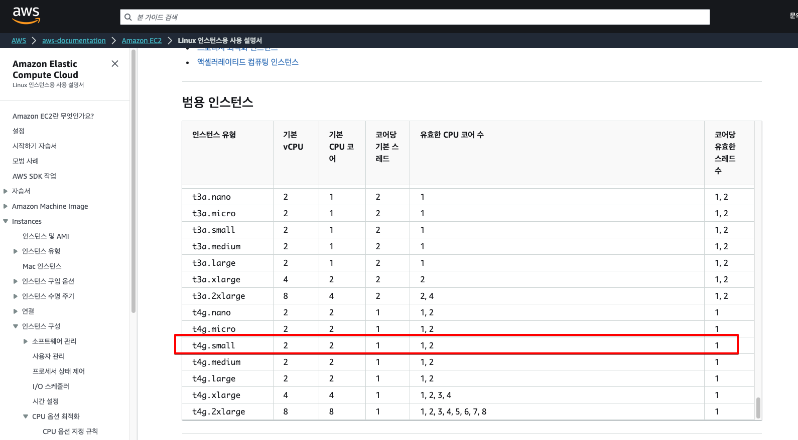
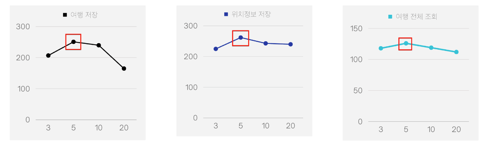

# HikariCP 설정

데이터베이스를 사용하는 애플리케이션 서버는 DB와 Connecting 비용을 줄이기 위해 커넥션 풀을 생성하고 관리한다.  
SpringBoot 는 커넥션 풀 프레임워크로 HikariCP를 사용한다.  
개발자는 application.yml 파일 등을 조작하여 HikariCP의 설정을 제어할 수 있으며, 이는 애플리케이션 성능에 영향을 미친다.  
트립드로우는 HikariCP의 Pool size 를 조정해 애플리케이션의 성능을 높이고자 시도했다.  

### 공식문서 참조

HikariCP의 Github wiki 에는 최적 Pool Size를 도출하는 공식이 명시되어 있다.

> **The Formula**  
> Connections = (core_count * 2) + effective_spindle_count
>

core_count : 컴퓨터 CPU 코어의 수를 의미한다.  
effective_spindle_count : 회전하는 하드디스크(HDD)의 수를 의미한다.  
만약 4-Core의 CPU와 하나의 하드 디스크를 갖는 컴퓨터라면, 최적의 Connection Pool Size는 9이다.

> 9 = (4 * 2) + 1

프로젝트에서 사용하는 EC2 인스턴스에 대해서 해당 공식의 해를 도출해보았다.  
트립드로우의 인스턴스는 t4g.small 이며, SSD로 구성된 AMI를 사용한다.  

AWS의 문서에 따르면 t4g.small 인스턴스의 CPU 코어는 2개이다. 따라서 core_count = 2이다.  
EC2는 HDD 가 아니라 SSD를 사용한다. 따라서 공식의 effective_spindle_count의 값을 정하기 모호했다.

> There hasn't been any analysis so far regarding how well the formula works with SSDs.
>

HikariCP 문서에서는 SSD에 대해서는 명확한 결론을 내리지 않고 있다.  
결국 직접 실험을 통해 최적의 Pool size를 찾아야 했다.

### 실험

실험은 NGrinder로 다수의 사용자가 서버에 요청을 보내는 상황을 가정하고 HikariCP의 `maximum-pool-size`를 달리하며 TPS를 측정했다.  
총 100명의 가상 사용자가 점진적으로 3분 동안 서버에 요청을 보내도록 했다.  
또한 DB가 처리하는 쿼리에 따라 실험 결과가 달라질 수 있음을 염두에 두고 `여행 저장`, `위치정보 저장`, `여행 전체 조회` 세 종류의 API 를 실험 대상으로 선정했다.

### 실험 정보

구체적인 실험 정보는 다음과 같다.

NGrinder 설정

- VUser : 200
- ramp-up : 초당 1씩 증가
- Test time : 3 minute

API

- POST : /trips
- POST : /points
- GET : /trips (임의의 데이터 10만개 기준)

maximum-pool-size 설정

- 3
- 5 (SSD를 effective_spindle_count = 1로 치환했을 때 공식의 해)
- 10 (Spring boot default)
- 20

### 실험 결과

실험 결과 세 종류의 API 에서 모두 HikariCP의 `maximum-pool-size` 가 5일 때 TPS가 가장 높았다.

실제 값을 보면, 여행 저장 : 251, 위치정보 저장 : 262, 여행 전체 조회 : 126 TPS 를 기록했다.

### 결론

트립드로우는 HikariCP의 maximum-pool-size 를 5로 설정한다.  
이는 NGrinder 를 통한 성능 실험 중 가장 높은 TPS를 기록한 maximum-pool-size 이다.  
구체적으로, Spring boot의 default 설정 값보다도 높은 성능을 보였다.  
또한 SSD를 effective_spindle_count = 1로 치환했을 때 Connections 공식의 해이기도 하다.   
공식 문서의 정보와 결을 같이 하는 결과라고 볼 수 있다.

### 참고자료

https://github.com/brettwooldridge/HikariCP/wiki/About-Pool-Sizing#the-formula  
https://dba.stackexchange.com/questions/228663/what-is-effective-spindle-count  
https://docs.aws.amazon.com/ko_kr/AWSEC2/latest/UserGuide/cpu-options-supported-instances-values.html  
