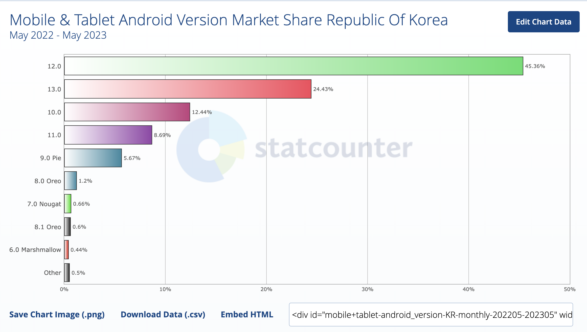
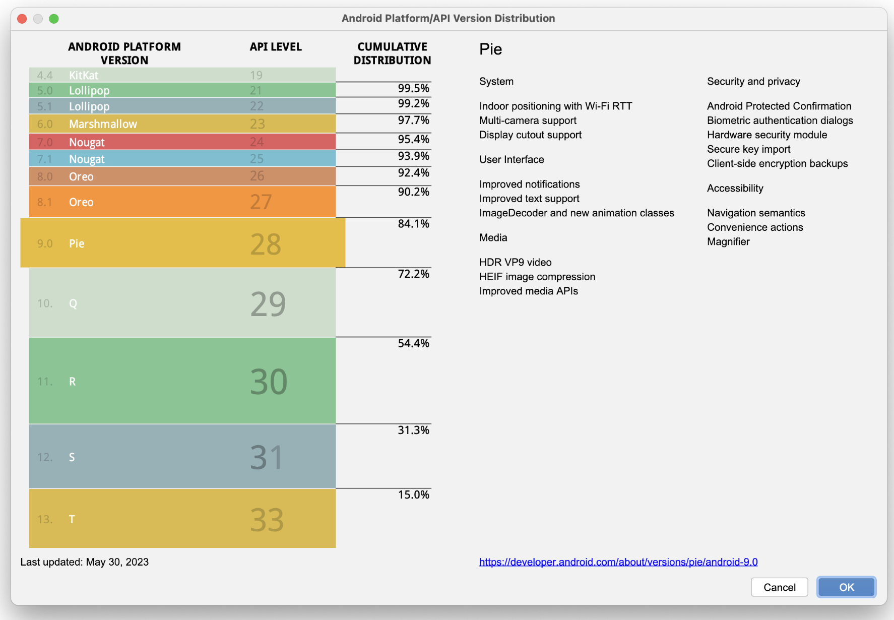

# 기술스택

### Architecture Pattern

- MVVM

  ​	장점

  1. 테스트가 용이하다.(불필요한 Mocking 의 제거)
  2. 뷰모델로부터 뷰에대한 의존성을 끊어냄으로써 조금더 유연한 코드를 작성할 수 있다.(n:1 관계 설정가능)
  3. 비지니스 로직과 뷰로직의 경계선이 명확하여 확실하게 캡슐화 할 수 있다.(관심사 분리의 편의성)

### AAC

- Data Binding

- LiveData

- ViewModel

### HttpClient

- Okhttp3
- Retrofit2

HTTP 통신 라이브러리로 Ktor, Volley 또한 고려 해보았다.

Ktor의경우 멀티플랫폼을 적용하는데 유용하고 경량화 되어있다는 장점이있지만 java 환경에는 사용하지못하여(안드로이드 환경에서는 좋지못하다고 판단) 고려대상에서 제외되었다.

Volley의 경우 Retrofit이 속도가 빠르다는 점에서 제외되었다.

Retrofit의 경우 이미 안드로이드 생태계에서 많은 비중을 차지하고 있으며 json 컨버팅 라이브러리인 moshi와도 조합이 좋다.

강력한 라이브러리를 제공하는 square사에서 나왔으므로 추후 지원에 있어서도 긍적적으로 작용하였다.

또한 현재 팀원들의 이해도가 제일 높고 사용하기 좋은 Retrofit,okhttp를 사용함으로써 필요한 부분을 커스텀하여 사용할수 있어 채택되었다.

### Async Task

- coroutine

### Serialize Library

Parcelable(Pacelize)

- 현재 직렬화의 주요 사용처는 액티비티간 데이터 전달이다. 즉 Presentation layer에 직렬화의 책임이 있다.
- 각 layer와 모델을 간소화 하여 사용한다면 domain에 직렬화의 책임을 전가할 수 있겠지만 이는 변화의 유연성을 떨어트리고 현재 팀원과의 합의하게 각 layer와 model을 정확히 구분하기로 하였으므로 code-generation 방식으로 성능이 좋고 Parcelize 플러그인을 통한 보일러플레이트 코드의 제거가 용이한 Parcelable를 사용한다.
- 또한 Parcelable은 Serialization 보다 안드로이드 편의성 측면에서 많은 기능을 제공한다.

### Third Party Library

##### 이미지 처리 라이브러리

|        | coil                                    | glide  | picasso |
| ------ | --------------------------------------- | ------ | ------- |
| 제작사 | [InstaCart](https://www.instacart.com/) | google | square  |
| 속도   | -                                       | 빠름   | 느림    |
| 메모리 | -                                       | 적음   | 큼      |
| 기능수 | -                                       | 많음   | 적음    |

glide를 사용

- coil은 최신의 검증이 더 필요한 라이브러리라고 판단되며 관리주체의 신뢰도가 떨어져서 유지보수의 문제가 생길수도 있다고 판단하여 제외하였다.
- Picasso는 매우 강력한 제작사인 square에서 나왔으나 glide에 비해 기능수가 적으므로 개발자 입장에서 불편함이 체감될수 있어 제외하였다.

##### json converter 라이브러리

|          | moshi              | Gson       | kotlin serialization |
| -------- | ------------------ | ---------- | -------------------- |
| 제작사   | square             | google     | Jet brains           |
| 구동방식 | Code-gen,refection | reflection | Code-gen             |
| 언어     | kotlin             | java       | kotlin               |

Moshi를 사용

- Jackson, Gson의 경우 Java기반 라이브러리로서 Kotlin을 사용하는 현재 프로젝트의 경우 언어의 차이로인한 불편한 점이 많아서 배제되었다.
- Kotlin serialization의 경우 사용을 고려해보았지만 moshi의 장점이 더 많다고 생각하여 moshi를 사용함
- moshi의 경우 Code-gen,refection 방식을 모두 지원하며 kotlin으로 이루어져있어 편리하다 또한 내부적으로 okio를 이용함으로 현재 사용중인 okhttp,retrofit과 버퍼를 공유할 수 있어 메모리를 덜 차지하는 장점이 있다. 또한 json converting의 경우 현재 서버통신에서 가장 많이 사용됨으로 square의 라이브러리를 함께 사용하는것은 메모리 측면에서 많은 이점을 가진다.

## 안드로이드 버전

Android 8.0 (minsdk 26)

https://gs.statcounter.com/android-version-market-share/mobile-tablet/south-korea/#monthly-202205-202305-bar

대한민국 기준으로 8.0미만 버전 사용자는 3퍼센트 미만이고 현재 국내에서만 서비스를 시행할 예정이로 8.0 미만의 버전을 지원하지 않아도 무방하다.

전세계 기준으로도 8.0 기준으로 92.4%의 커버리지를 갖는다.