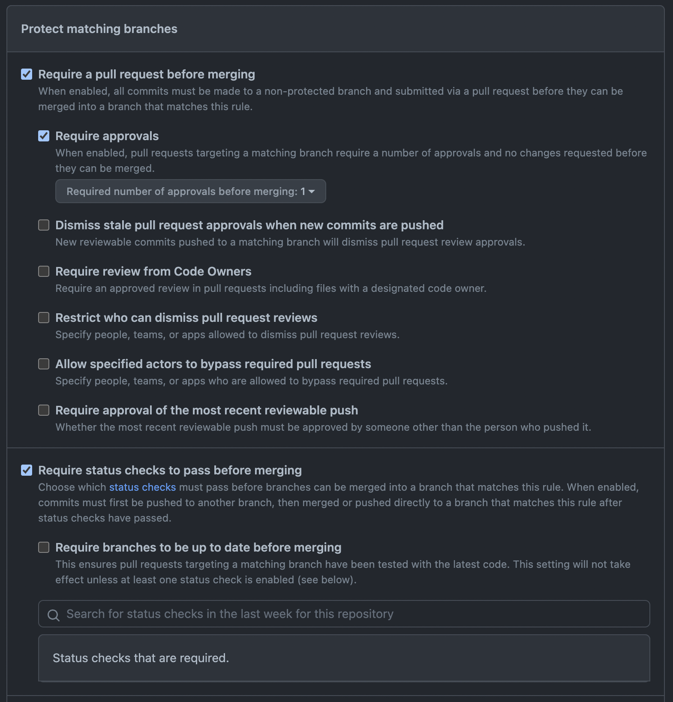

### 브랜치 룰 설정 위치

repository -> settings -> branches -> Add rules

### Branch name pattern

브랜치 적용 대상 설정  
모든 브랜치 대상: `**/**`

### 브랜치 보호 설정

Require a pull request before merging -> pr을 통해 merge 필요  
Require approvals -> pr 요청 최소 승인 인원  
Require status checks to pass before merging -> 설정한 ci 통과 등  

