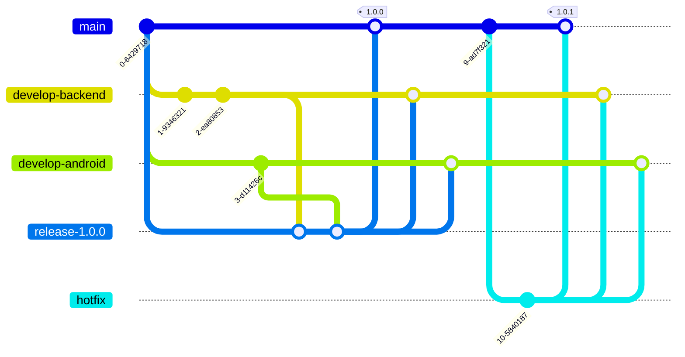

### 브랜치 전략

Git-Flow의 변형을 사용한다.

| 브랜치명        | 설명                                                   | 병합                                                        | 삭제         | 예시          |
| --------------- | ------------------------------------------------------ | ----------------------------------------------------------- | ------------ | ------------- |
| main            | 단일 브랜치. 플레이스토어 배포 기준                    | -                                                           | X            |               |
| release         | 버전마다 생성되는 개발 브랜치에서 분기하는 배포 브랜치 | main 브랜치와 개발 브랜치에 병합한다.                       | X            | release-1.1.0 |
| develop-backend | 백엔드 개발 브랜치                                     | -                                                           | X            |               |
| develop-android | 안드로이드 개발 브랜치                                 | -                                                           | X            |               |
| feature         | 기능별 브랜치                                          | 기능 구현시 생성하고 구현 완료시 각 개발 브랜치에 병합한다. | 병합 후 삭제 | feature/#34   |
| hotfix          | main에서 분기하는 버그 수정용 브랜치                   | 버그가 수정될 시 main 브랜치와 개발 브랜치에 병합한다.      | 병합 후 삭제 | hotfix/#49    |

### 예시

feature에 대한 예시 생략

